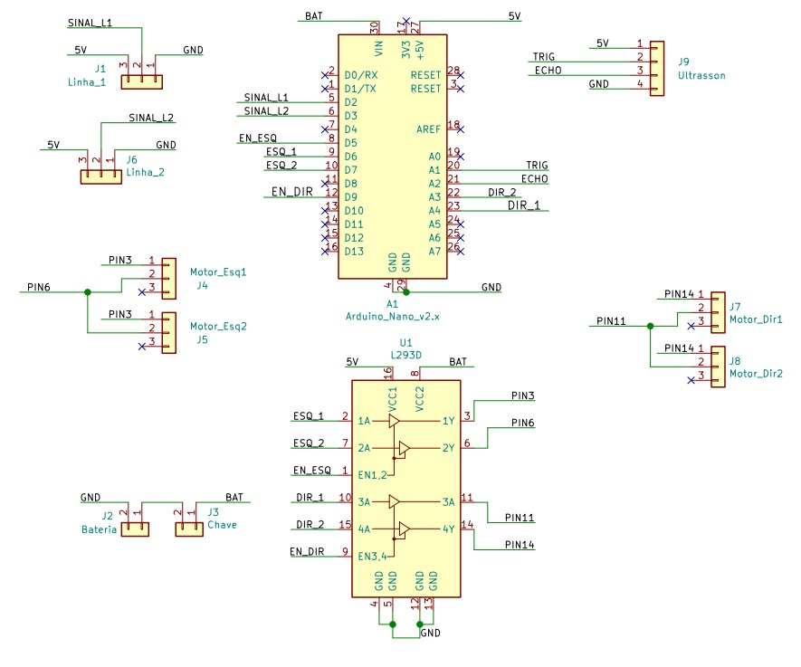

# Plataforma para desenvolvimento de protótipos móveis

## Objetivo

O LabPRO dispõe de uma plataforma que auxília o desenvolvimento de protóripos móveis tais como robô seguidor de linha, robô sumô e outros. Os códigos e informações disponibilizados neste repositório são para uso nesta plataforma e servem de base para adição de novas funcionalidades.

## A plataforma

A plataforma é composta de um chassi com quatro rodas, dois sensores Óptico Reflexivo TCRT5000, CI Ponte H L293, um sensor ultrassom HC-SR04 e um arduino nano, como microcontrolador.

## Foto da plataforma

|Vista Lateral 1|Vista Interna|Vista Lateral 3|
|---|---|---|
| | | |


## Esquemático das conexões da plataforma



## Projeto da placa controladora

[Projeto da placa de controle para KiCad ](files/kicad.rar)

## Requisitos para uso

* Biblioteca Ultrasonic para Arduino de Erick Simões. Esta biblioteca pode ser adquirida por meio da sua IDE de preferência.

## Códigos disponíveis

* ```carrorobo.ino```: código contendo a movimentação básica do robô. A lógica de movimentação é simples e considera movimentação em uma arena. O robô move para frente até encontrar o fim da arena. A arena tem a cor preta, e a borda branca, portanto ao detectar a borda, a leitura do sensor TCRT5000 mudará de 0 para 1. Nesta situação, o robô anda para trás e muda de direção. A direção do giro depende de qual sensor disparou a leitura, se o esquerdo ou o direito. Enquanto se move para frente, o robô faz a leitura do sensor de ultrassom e imprime a saída na interface serial, ou seja, nenhuma decisão é tomada com base nos dados deste sensor.
